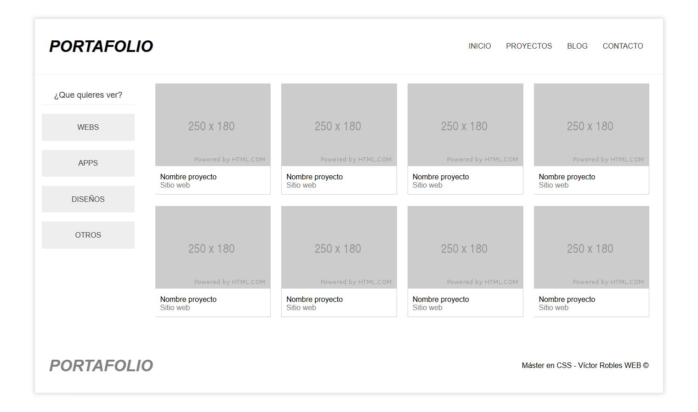

# Maqueta CSS - Flexbox

## Descripción general

Flexbox CSS

### Las principales herramientas y tecnologías utilizadas incluyeron:

- HTML5
- CSS  

### Visita el sitio web:

- [cssflexbox.github.io](https://roraima1986.github.io/roraima1986.github.io/cssflexbox.github.io/)
